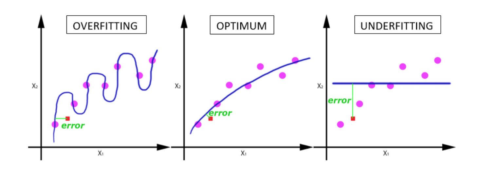
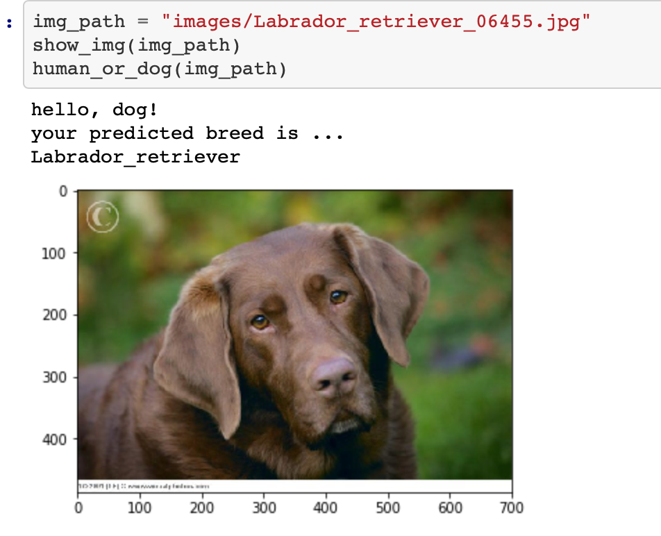
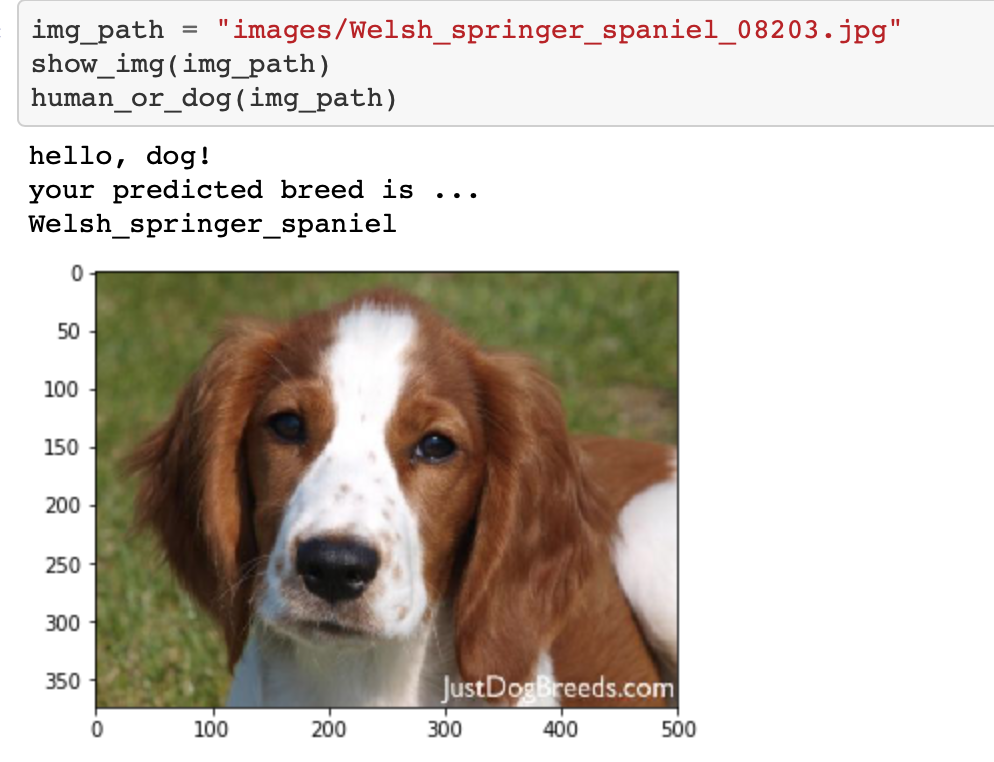

# Data Scientist Nanodegree / Convolutional Neural Networks

# Project: Write an Algorithm for a Dog Identification App

# Project Overview

At the end of this project, Our code will accept any user-supplied image as input. If a dog is detected in the image, it will provide an estimate of the dog's breed. If a human is detected, it will provide an estimate of the dog breed that is most resembling.

# Project Motivation

Though I have completed several guided projects, here I got a chance to show off my skills and creativity. In this capstone project, i will leverage what i’ve learned throughout the program to build a data science project.
 
# The Road Ahead

The complete work has been divided into separate steps as below:

* [Step 0](#step0): Import Datasets
* [Step 1](#step1): Detect Humans
* [Step 2](#step2): Detect Dogs
* [Step 3](#step3): Create a CNN to Classify Dog Breeds (from Scratch)
* [Step 4](#step4): Use a CNN to Classify Dog Breeds (using Transfer Learning)
* [Step 5](#step5): Create a CNN to Classify Dog Breeds (using Transfer Learning)
* [Step 6](#step6): Write your Algorithm
* [Step 7](#step7): Test Your Algorithm

# Instructions :

In order to run this code on your local computer, you may need to install and download the following;

[Dog dataset](https://s3-us-west-1.amazonaws.com/udacity-aind/dog-project/dogImages.zip). Unzip the folder and place it in the repo, at location path/to/dog-project/dogImages.

[Human dataset](https://s3-us-west-1.amazonaws.com/udacity-aind/dog-project/lfw.zip). Unzip the folder and place it in the repo, at location path/to/dog-project/lfw. If you are using a Windows machine, you are encouraged to use 7zip to extract the folder.

[VGG-16 bottleneck](https://s3-us-west-1.amazonaws.com/udacity-aind/dog-project/DogVGG16Data.npz) features for the dog dataset. Place it in the repo, at location path/to/dog-project/bottleneck_features.

[VGG-19 bottleneck features](https://s3-us-west-1.amazonaws.com/udacity-aind/dog-project/DogVGG19Data.npz) for the dog dataset. Place it in the repo, at location path/to/dog-project/bottleneck_features.

[ResNet-50 bottleneck features](https://s3-us-west-1.amazonaws.com/udacity-aind/dog-project/DogResnet50Data.npz) for the dog dataset. Place it in the repo, at location path/to/dog-project/bottleneck_features.

[Inception bottleneck features](https://s3-us-west-1.amazonaws.com/udacity-aind/dog-project/DogInceptionV3Data.npz) for the dog dataset. Place it in the repo, at location path/to/dog-project/bottleneck_features.

[Xception bottleneck](https://s3-us-west-1.amazonaws.com/udacity-aind/dog-project/DogXceptionData.npz) features for the dog dataset. Place it in the repo, at location path/to/dog-project/bottleneck_features

I recommend setting up an environment for this project to ensure you have the proper versions of the required libraries.

# Installation Required:

For Mac/OSX:

	conda env create -f requirements/aind-dog-mac.yml
	source activate aind-dog
	KERAS_BACKEND=tensorflow python -c "from keras import backend"

For Linux:

	conda env create -f requirements/aind-dog-linux.yml
	source activate aind-dog
	KERAS_BACKEND=tensorflow python -c "from keras import backend"

For Windows:

	conda env create -f requirements/aind-dog-windows.yml
	activate aind-dog
	set KERAS_BACKEND=tensorflow
	python -c "from keras import backend"
 
This project requires Python 3 and the following Python libraries installed:

      NumPy
      Pandas
      matplotlib
      scikit-learn
      keras
      OpenCV
      Matplotlib
      Scipy
      Tqdm
      Pillow
      Tensorflow
      Skimage
      IPython Kernel

I recommend to install Anaconda, a pre-packaged Python distribution that contains all of the necessary libraries and software for this project

# File Descriptions

dog_app.ipynb - The file where the codes and possible solutions can be found.

bottleneck_features -When you Pick one of the above architectures, download the corresponding bottleneck features, and store the downloaded file in the bottleneck_features/ folder in the repository.

Images Folder - We will find here the images to test our algorithm. Use at least two human and two dog images.

saved_models - Where you will find the models those i worked on

# Improvements Section :

**Create a CNN to Classify Dog Breeds (from Scratch)**

I create a CNN from scratch using transfer learning to train a CNN , **with test accuracy of 5.9809 %.**

the major steps required to build the Convolutional Neural Network to classify images are :

    1. Creation of Convolutional layers by applying kernel or Feature Maps.
    2. Applying Max pool for Translational Invariance.
    3. Flattening of Inputs.
    4. Creation of a Fully Connected Neural Network.
    5. Training the model.
    6. Prediction of the output.

Convolution Layers will deal with our input images, which are seen as 2-dimensional matrices. Convolution is applied on the input data using a convolution filter to produce a feature map. The size of Kernel is the size of the filter matrix for our convolutional layer. Therefore, a kernel size of 2 means a 2x2 filter matrix or feature detector. The filter is slided over the input.

We can control the behavior of Convolutional Layer by controlling the number of filters and the size of each filter. Like, to increase the number of nodes in a convolutional layer, the number of filters can be increased. Aaaand, In order to increase the size of your detected pattern you could increase the size of your filter.

Further, Padding is done to make sure that the height and width of the output feature maps matches with the inputs. The ReLU (Rectifier Linear Unit) is the activation function we gonna use here to help us deal with the non linearity in the neural network. Our first layer also takes in an input image of shape: 224, 224, 3.

Higher the dimension, more is the use of parameters, may lead to overfitting. Pooling is used for dimensionality reduction. Max Pooling Layer has been used here for providing translational invariance. Translational invariance means that the output doesnot change owing to slight variation in the input. Max pooling reduces the number of cells. Pooling helps detect features like colors, edges etc. For max pooling, we use the pool_size of 2 by 2 matrix for all 32 feature maps.

Thereafter, a "Flatten" layer has been used to serve as a connection between the convolution and dense layers. This helps to flatten all the inputs, which may serve as the input to the fully connected neural network.

Dense is the layer type we will use in for our output layer, as used in many cases for neural networks.

Also, we gonna use Dropout Rate of 20% to prevent overfitting.

The activation function used near the output layer is ‘softmax’, which makes the output in terms of 0 to 1 such that output can be interpreted as probabilities. And these probabilities will serve as the output prediction probability.

**Use a CNN to Classify Dog Breeds (using Transfer Learning)**

I used a CNN to Classify Dog Breeds from pre-trained VGG-16 model **with test accuracy: 38.1579 %.**

The model uses the the pre-trained VGG-16 model as a fixed feature extractor, where the last convolutional output of VGG-16 is fed as input to our model. We only add a global average pooling layer and a fully connected layer, where the latter contains one node for each dog category and is equipped with a softmax.

**Create a CNN to Classify Dog Breeds (using Transfer Learning)**

I then used Transfer learning to create a CNN that can identify dog breed from images **with 80.1435 % accuracy on the test set.**

My final CNN architecture is built with the Resnet50 bottleneck. Further, GlobalAveragePooling2D used to flatten the features into vector. These vectors were fed into the fully-connected layer towards the end of the ResNet50 model. The fully-connected layer contains one node for each dog category and is assisted with a softmax function.

# Further Scope for Improvement 

According to my opinion, the **model can further be improved** if following steps can be ensures :

**1. If more data is used to train deeper neural network or [Augmentation](https://blog.keras.io/building-powerful-image-classification-models-using-very-little-data.html) of the Training Data can be done** 

If we have to make the most of our few available training examples, we can "augment" them via a number of random transformations, so that our model would never see twice the exact same picture. This helps prevent overfitting and helps the model generalize better.

In Keras, this can be done via the keras.preprocessing.image.ImageDataGenerator class. This class allows you to configure random transformations and normalization operations to be done on your image data during training.

Also, it instantiates generators of augmented image batches (and their labels) via .flow(data, labels) or .flow_from_directory(directory). These generators can then be used with the Keras model methods that accept data generators as inputs, fit_generator, evaluate_generator and predict_generator.

The rotation_range is a value in degrees (0-180), a range within which pictures are rotated randomly. The width_shift and height_shift are ranges (as a fraction of total width or height) within which the pictures are translated randomly in vertical or horizontal position.

The rescale is a value by which we will multiply the data before any other processing. Our original images consist in RGB coefficients in the 0-255, but such values would be too high for our models to process (given a typical learning rate), so we target values between 0 and 1 instead, by scaling with a 1/255 factor.

The shear_range is done for randomly applying shearing transformations. The zoom_range is used for randomly zooming inside pictures. The horizontal_flip is done for randomly flipping half of the images horizontally relevant when there are no assumptions of horizontal assymetry (e.g. real-world pictures). The fill_mode is the strategy used for filling in newly created pixels, which can appear after a rotation or a width/height shift.

**2. Incase if we add more number of [epochs](https://towardsdatascience.com/epoch-vs-iterations-vs-batch-size-4dfb9c7ce9c9) in the training process but in the instant, we can't do it as it will lengthen training**

One Epoch is when an ENTIRE dataset is passed forward and backward through the neural network only ONCE.

On question that naturally hits one's mind is - Why we use more than one Epoch? I know it is stupid to state that passing the entire dataset through a neural network is not enough. But remember that we are using a limited dataset and to optimise the learning and the graph we are using Gradient Descent which is an iterative process. So, updating the weights with single pass or one epoch is not enough.

We can see that One epoch leads to underfitting of the curve in the graph (below)

With the number of epochs increases, more number of times the weight are changed in the neural network and the curve goes from underfitting to optimal to overfitting curve.

So, what is the right numbers of epochs? Unfortunately, there is no right answer to this question. The answer is different for different datasets but we can say that the numbers of epochs is related to how diverse our data is.!

**3. Incase if we use more [layers](https://machinelearningmastery.com/how-to-control-neural-network-model-capacity-with-nodes-and-layers/) of the neural network** 

The capacity of a neural network can be controlled by two aspects of the model:

                1. Number of Nodes

                2. Number of Layers

A model with more nodes or more layers is potentially more capable of learning a larger set of mapping functions. A model with more layers and more hidden units per layer has higher representational capacity, means it is capable of representing more complicated functions. But it varies with case to case as the chosen learning algorithm may or may not be able to realize this capability.

Infact, Increasing the number of layers provides a short-cut to increasing the capacity of the model with fewer resources, and modern techniques allow learning algorithms to successfully train deeper models.

# Result Section :

The use of 'transfer learning - Resnet50 model' to implement an algorithm for a Dog identification application has been demonstrated here. The user can provide an image, and the algorithm first detects whether the image is human or dog. If it is a dog, it predicts the breed. If it is a human, it returns the resembling dog breed. The model produces the test accuracy of around 80%. The scope of further improvements has also been suggested in this work.

Here are examples of the algorithms:

# Hey guys.!! The step-wise thought process of creating this model and its results is available here in my [blog](https://medium.com/@manishislampur1988/fun-with-cnn-app-to-identify-breed-of-your-doggy-9d3dbd06c513)**
